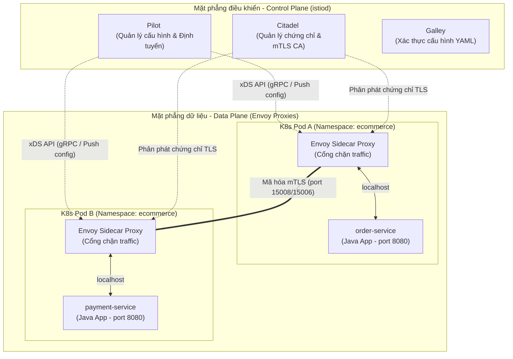
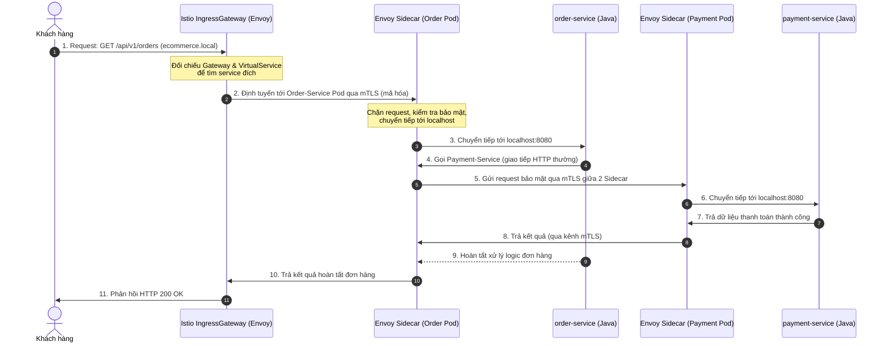

# Tài Liệu Hướng Dẫn Trực Quan: Kiến Trúc, Luồng Hoạt Động & Cách Sử Dụng Istio

Tài liệu này giải thích chi tiết về **Istio Service Mesh** — công nghệ cốt lõi giúp quản lý, bảo mật và giám sát các dịch vụ microservices trong cụm Kubernetes của dự án Ecommerce.

---

## 1. Istio Service Mesh là gì?

Khi hệ thống chuyển từ kiến trúc Monolith sang Microservices, số lượng dịch vụ tăng lên nhanh chóng kéo theo nhiều thách thức phức tạp:
*   **Định tuyến lưu lượng:** Làm thế nào để chia nhỏ tải (Canary Deployment, A/B Testing), định tuyến dựa trên HTTP Header?
*   **Bảo mật:** Làm sao để mã hóa toàn bộ dữ liệu truyền qua lại giữa các service (mTLS) và phân quyền chi tiết?
*   **Giám sát (Observability):** Làm thế nào để theo dõi toàn bộ đường đi của một request qua nhiều service nhằm phát hiện nghẽn cổ chai?

**Istio** giải quyết tất cả các vấn đề trên bằng cách tách biệt logic mạng (networking) ra khỏi mã nguồn ứng dụng thông qua mô hình **Service Mesh**.

---

## 2. Kiến trúc của Istio (Architecture)

Istio chia hệ thống thành hai phần chính: **Control Plane** (Mặt phẳng điều khiển) và **Data Plane** (Mặt phẳng dữ liệu).

### Sơ đồ kiến trúc tổng quan



### Chi tiết các thành phần:

1.  **Data Plane (Mặt phẳng dữ liệu):**
    *   Được cấu thành từ các **Envoy Proxy** hiệu năng cao chạy song hành (Sidecar) bên trong cùng một Pod với ứng dụng của bạn.
    *   Tất cả lưu lượng đi vào (Ingress) và đi ra (Egress) của Pod ứng dụng đều bị cấu hình `iptables` ép buộc phải đi qua Envoy Proxy trước.
    *   Envoy chịu trách nhiệm: Định tuyến traffic, lọc Header, mã hóa mTLS, thu thập logs/metrics và giới hạn băng thông.
2.  **Control Plane (Mặt phẳng điều khiển - `istiod`):**
    *   **Pilot:** Chuyển đổi các cấu hình YAML của Istio (như VirtualService) thành định dạng cấu hình mà Envoy hiểu được và đẩy xuống tất cả các Proxy chạy dưới dạng sidecar.
    *   **Citadel:** Đóng vai trò là một Certificate Authority (CA) nội bộ, tự động cấp phát, thu hồi và gia hạn chứng chỉ TLS cho các Envoy Proxy để kích hoạt mTLS.
    *   **Galley:** Thu nhận, xác thực tính đúng đắn của các tệp Manifest cấu hình trước khi gửi sang Pilot.

---

## 3. Luồng Hoạt Động Của Traffic (Operational Flow)

Khi một khách hàng thực hiện đặt hàng trên ứng dụng Ecommerce, request sẽ đi qua các bước được biểu diễn qua luồng tuần tự dưới đây:



### Các bước hoạt động:
1.  **Ingress Gateway:** Request từ Internet đi vào Ingress Gateway (cổng duy nhất của Istio). Gateway đối chiếu với các tài nguyên `Gateway` và `VirtualService` để quyết định chuyển tiếp request đến Service nào.
2.  **Mã hóa tự động (mTLS):** Khi Gateway chuyển tiếp đến `order-service`, dữ liệu truyền đi giữa Gateway và Envoy Sidecar của `order-service` được mã hóa tự động nhờ mTLS (mutual TLS).
3.  **Local Delivery:** Sidecar của `order-service` giải mã gói tin và gửi nó vào localhost của Container `order-service` trên port 8080.
4.  **Service-to-Service Traffic:** Khi `order-service` cần gọi sang `payment-service` qua DNS `http://payment-service:8080`, Sidecar của `order-service` sẽ chặn đứng request này, chuyển đổi nó thành HTTPS mTLS để giao tiếp an toàn với Sidecar của `payment-service`.

---

## 4. Cách Sử Dụng Istio (Các Cấu Hình CRD Cốt Lõi)

Istio cung cấp các Custom Resource Definitions (CRD) giúp lập trình viên điều phối mạng dễ dàng.

### 4.1. Gateway (Cổng Đón Traffic)
Định cấu hình các cổng mở (80/443), giao thức và máy chủ (domain) chấp nhận kết nối vào cụm Kubernetes.

```yaml
apiVersion: networking.istio.io/v1beta1
kind: Gateway
metadata:
  name: ecommerce-gateway
  namespace: ecommerce
spec:
  selector:
    istio: ingressgateway # Sử dụng Istio Ingress Gateway mặc định
  servers:
  - port:
      number: 80
      name: http
      protocol: HTTP
    hosts:
    - "ecommerce.local"      # Chỉ nhận request từ domain này
    - "*.ecommerce.local"
```

### 4.2. VirtualService (Định Tuyến Chi Tiết)
Quyết định cách định tuyến các request sau khi đi qua Gateway hoặc khi các service nội bộ giao tiếp với nhau.

#### Ví dụ 1: Định tuyến Canary (90% traffic cho v1, 10% traffic cho v2)
```yaml
apiVersion: networking.istio.io/v1beta1
kind: VirtualService
metadata:
  name: order-service-routing
  namespace: ecommerce
spec:
  hosts:
  - order-service
  http:
  - route:
    - destination:
        host: order-service
        subset: v1
      weight: 90
    - destination:
        host: order-service
        subset: v2
      weight: 10
```

#### Ví dụ 2: Định tuyến dựa trên Header (Đưa người dùng VIP đến bản thử nghiệm v2)
```yaml
apiVersion: networking.istio.io/v1beta1
kind: VirtualService
metadata:
  name: frontend-routing
  namespace: ecommerce
spec:
  hosts:
  - "ecommerce.local"
  gateways:
  - ecommerce-gateway
  http:
  - match:
    - headers:
        x-user-role:
          exact: premium      # Nếu request mang Header 'x-user-role: premium'
    route:
    - destination:
        host: frontend-service
        subset: v2            # Định tuyến tới phiên bản v2
  - route:                    # Mặc định tất cả user thường
    - destination:
        host: frontend-service
        subset: v1            # Định tuyến tới phiên bản v1
```

### 4.3. DestinationRule (Quy Định Điểm Đến & Load Balancing)
Định nghĩa các nhóm phiên bản (`subsets`) dựa trên nhãn (labels) của Pod K8s và chỉ định chiến lược cân bằng tải hoặc cấu hình mTLS bảo vệ.

```yaml
apiVersion: networking.istio.io/v1beta1
kind: DestinationRule
metadata:
  name: order-service-subsets
  namespace: ecommerce
spec:
  host: order-service
  trafficPolicy:
    loadBalancer:
      simple: ROUND_ROBIN
    tls:
      mode: ISTIO_MUTUAL # Kích hoạt mTLS chuẩn của Istio
  subsets:
  - name: v1
    labels:
      version: v1.0.0
  - name: v2
    labels:
      version: v2.0.0
```

### 4.4. PeerAuthentication (Bảo Mật mTLS Cụm)
Ép buộc mTLS giữa các Service trong Namespace để đảm bảo không ai có thể can thiệp/nghe lén dữ liệu trên đường truyền.

```yaml
apiVersion: security.istio.io/v1beta1
kind: PeerAuthentication
metadata:
  name: default
  namespace: ecommerce
spec:
  mtls:
    mode: STRICT # STRICT: Bắt buộc mã hóa mTLS, từ chối kết nối HTTP thường
```

---

## 5. Cách Triển Khai & Kiểm Tra Istio Trong Dự Án

### Bước 1: Kích Hoạt Istio Injection Cho Namespace
Để Istio tự động cài đặt Sidecar (Envoy Proxy) vào các Pods khi deploy, ta gán nhãn cho namespace tương ứng:
```bash
kubectl create namespace ecommerce
kubectl label namespace ecommerce istio-injection=enabled
```

### Bước 2: Deploy Ứng Dụng
Khi bạn deploy ứng dụng vào namespace `ecommerce`, một container Envoy Sidecar (`istio-proxy`) sẽ tự động xuất hiện bên trong Pod cùng với container chính:
```bash
kubectl get pods -n ecommerce
# Kết quả hiển thị READY 2/2 (1 container app + 1 container sidecar proxy)
# Ví dụ: order-service-594f86644f-abcde   2/2     Running   0          5m
```

### Bước 3: Quan sát hạ tầng thông qua các công cụ tích hợp
Istio đi kèm với hệ sinh thái giám sát tuyệt vời:
*   **Kiali:** Giao diện trực quan hóa sơ đồ mạng của Service Mesh. Bạn có thể nhìn thấy trực tiếp luồng traffic thực tế chạy từ service này sang service khác, trạng thái lỗi (xanh/đỏ/vàng) và băng thông.
    *   Bật Kiali Dashboard: `istioctl dashboard kiali`
*   **Jaeger:** Trực quan hóa Distributed Tracing. Giúp bạn xem tổng thời gian thực thi của một request đi qua `order-service` -> `payment-service` tiêu tốn bao nhiêu mili-giây ở mỗi trạm.
    *   Bật Jaeger: `istioctl dashboard jaeger`
*   **Grafana:** Bảng điều khiển xem hiệu năng sử dụng CPU/RAM của các Envoy Proxy, tỉ lệ lỗi HTTP 5xx, số lượng request trên giây (RPS).
    *   Bật Grafana: `istioctl dashboard grafana`
